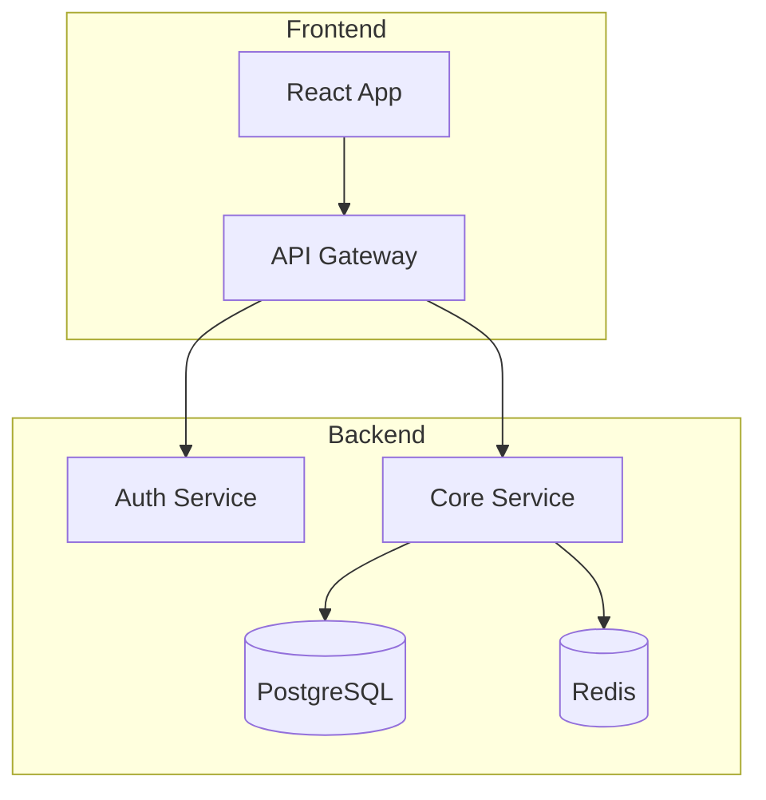
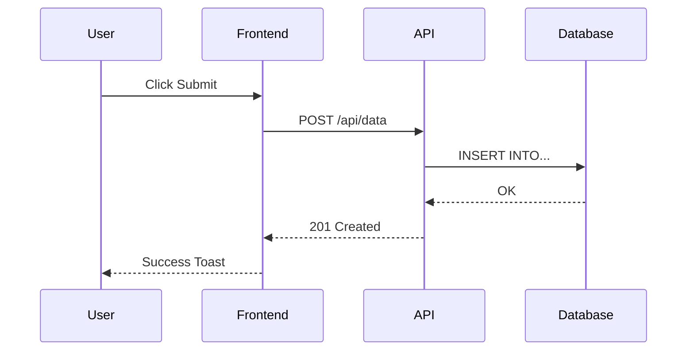
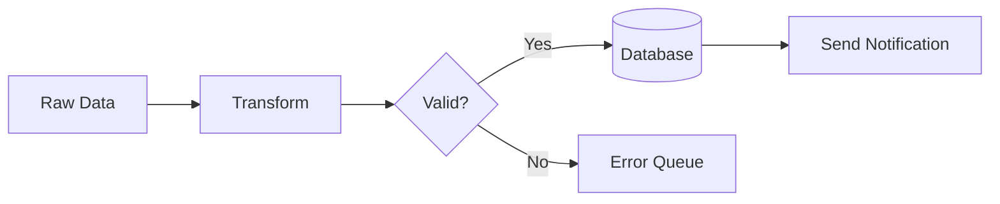
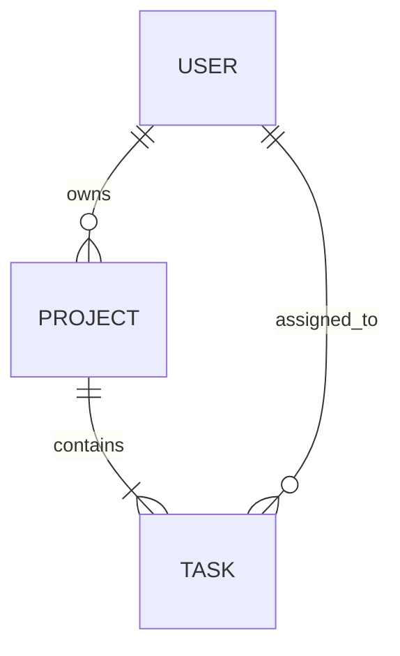
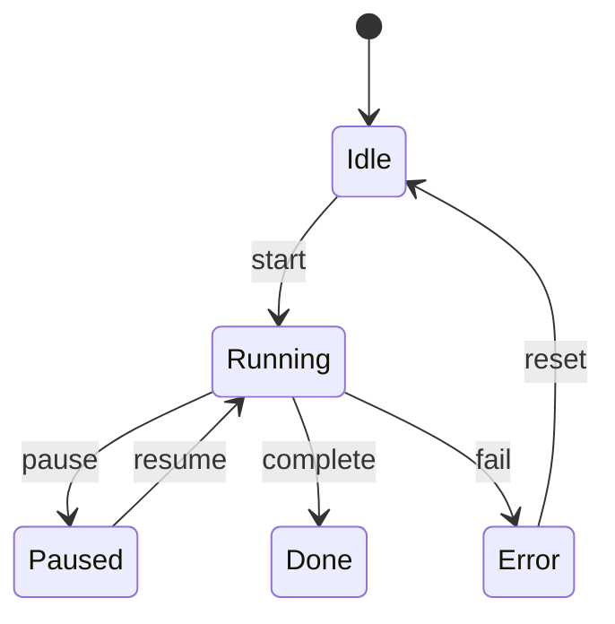
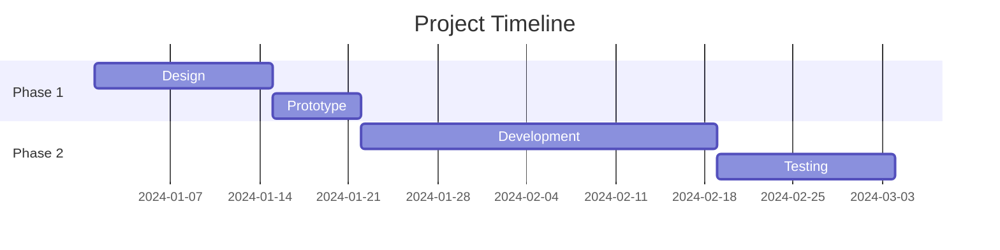

# Mermaid Diagrams & Architecture Visualization

Generate Mermaid.js diagrams for system architecture, data flows, sequence diagrams, ERDs, and project planning. Use when the user asks to visualize architecture, create flowcharts, draw sequence diagrams, map data flows, or document system design.

## Triggers
- "draw a diagram", "create a flowchart", "architecture diagram"
- "sequence diagram", "data flow", "ERD", "entity relationship"
- "visualize the system", "map the architecture"
- "Mermaid diagram", "system diagram"
- When documenting or explaining complex systems

## Diagram Types

### 1. System Architecture (C4-style)

### 2. Sequence Diagrams

### 3. Data Flow / Pipeline

### 4. Entity Relationship Diagrams

### 5. State Diagrams

### 6. Gantt / Timeline

## Best Practices
1. Always use descriptive node labels (not just A, B, C)
2. Group related components in subgraphs
3. Use appropriate arrow styles (solid for sync, dashed for async)
4. Include data annotations on edges where relevant
5. Keep diagrams focused — split large systems into multiple diagrams
6. Save diagrams as `.md` files with embedded Mermaid blocks
7. For HTML output, use ``

## Auto-Generation Pattern
When asked to document an existing codebase:
1. Read the main source files (entry points, routers, models)
2. Identify key components and their relationships
3. Map the request/response flow
4. Generate appropriate diagram type(s)
5. Save to `docs/architecture.md` or similar
