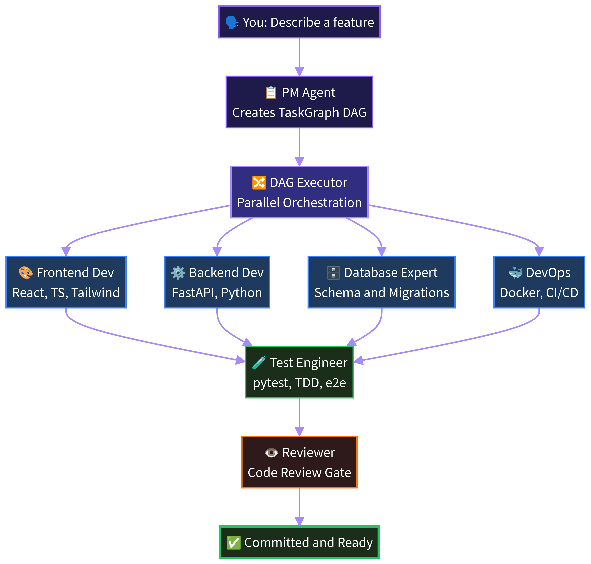

<div align="center">



# 🧠 Hivemind

### One prompt. A full AI engineering team. Go lie on the couch.

[](https://github.com/cohen-liel/hivemind/stargazers)
[](LICENSE)
[](https://python.org)
[](https://typescriptlang.org)
[](https://docs.anthropic.com/en/docs/claude-code)
[](https://github.com/openclaw/openclaw)
[](https://github.com/cohen-liel/hivemind/actions/workflows/ci.yml)
[](https://cohen-liel.github.io/hivemind/)

**Describe a feature in plain English. Hivemind deploys a PM, developers, reviewer, and QA — all working in parallel — and delivers tested, committed code. No babysitting. No copy-pasting. No "continue".**

[Website](https://cohen-liel.github.io/hivemind/) · [Quick Start](#-quick-start) · [How It Works](#-how-it-works) · [Architecture](#-architecture) · [Features](#-features) · [Dashboard](#-dashboard) · [Agent Roster](#-agent-roster) · [Contributing](CONTRIBUTING.md)

</div>

---

## What is Hivemind?

# Open-source AI engineering team that builds production code while you sleep

**If Claude Code is a _developer_, Hivemind is the _engineering team_.**

Hivemind is a Python orchestrator and React dashboard that turns AI coding agents into a full software engineering team. Give it one prompt — it plans the work, spins up specialist agents in parallel, passes artifacts between them, reviews the output, and commits tested code.

Under the hood: a LangGraph-based DAG executor, adaptive complexity triage, read-only code review, self-healing retry logic, and a single living DAG that grows dynamically as you send new messages.

**Ship features, not prompts.**

| Step | | Example |
| --- | --- | --- |
| **01** | Describe the feature | *"Add JWT authentication with a login page and protected routes"* |
| **02** | Watch the team work | Triage → Architect → PM plans → Frontend + Backend + DB work in parallel → Tests → Review |
| **03** | Get production code | Tested, reviewed, committed. Open your IDE and it's already there. |

> **COMING SOON: Template Marketplace** — Download pre-built project DAGs and run them with one click. SaaS starters, API backends, full-stack apps — pick a template and let the team build it.

&nbsp;

| **Works with** | 🤖 Claude Code | 🦞 OpenClaw | 🧪 Codex | ⌨️ Cursor | 🐚 Bash | 🌐 HTTP |

*If it can write code, it's hired.*

&nbsp;

## Hivemind is right for you if

- ✅ You want to **describe a feature once** and get production-ready code back
- ✅ You're tired of **babysitting Claude Code** — typing "continue", fixing context loss, managing files manually
- ✅ You want **parallel execution** — frontend, backend, and tests built simultaneously
- ✅ You want a **read-only code review gate** that critiques without breaking your code
- ✅ You want to **monitor everything from your phone** while lying on the couch
- ✅ You want **self-healing** — when an agent fails, the system fixes it automatically
- ✅ You want **zero extra API costs** — runs on your existing Claude Code subscription

&nbsp;

---

## ⚡ How It Works

```
You: "Add user authentication with JWT tokens and a login page"
                    │
                    ▼
         ┌──────────────────┐
         │   Triage          │  Simple task? → Skip planning, execute directly
         │   (Adaptive)      │  Complex task? → Full pipeline below
         └────────┬─────────┘
                  │
         ┌────────▼─────────┐
         │  Architect Agent  │  Reviews codebase, identifies patterns,
         │  (Pre-planning)   │  produces architecture brief
         └────────┬─────────┘
                  │
         ┌────────▼─────────┐
         │    PM Agent       │  Creates TaskGraph (DAG) with dependencies,
         │    (Planning)     │  file scopes, and role assignments
         └────────┬─────────┘
                  │
         ┌────────▼─────────┐
         │   LangGraph DAG   │  Executes tasks in dependency order.
         │    Executor       │  Parallel where safe, sequential where needed.
         └────────┬─────────┘
                  │
    ┌─────────────┼─────────────┐
    ▼             ▼             ▼
┌────────┐  ┌────────┐  ┌────────┐
│Backend │  │Frontend│  │Database│   Writer agents serialized (write lock),
│  Dev   │  │  Dev   │  │ Expert │   reader agents run in parallel
└───┬────┘  └───┬────┘  └───┬────┘
    │           │           │
    └─────────┬─┘───────────┘
              ▼
    ┌──────────────────┐
    │   Test Engineer   │   Tests the combined output
    └────────┬─────────┘
             ▼
    ┌──────────────────┐
    │    Reviewer       │   Read-only critique (no code modification).
    │  (Code Review)    │   Automated lint/format with test safety net.
    └────────┬─────────┘
             ▼
        ✅ Committed & Ready
```

**New message mid-execution?** It gets injected into the live DAG — adding or cancelling tasks dynamically. There is always exactly one DAG per project. No parallel DAGs, no lost messages.

&nbsp;

---

## 🏗️ Architecture

### Core Pipeline

| Stage | Component | File | Description |
|---|---|---|---|
| **Triage** | `_triage_is_simple()` | `orchestrator.py` | Lightweight heuristic that routes simple tasks directly to a single-agent execution, skipping PM + Architect. Inspired by SEMAG adaptive complexity. |
| **Architect** | `ArchitectAgent` | `architect_agent.py` | Pre-planning codebase review. Produces an `ArchitectureBrief` (patterns, conventions, key files) that the PM uses for better planning. |
| **PM** | `create_task_graph()` | `pm_agent.py` | Decomposes the request into a `TaskGraph` — a DAG of typed `TaskInput` nodes with role assignments, file scopes, and dependency wiring. Task count scales with complexity (no forced minimums). |
| **DAG Executor** | LangGraph `StateGraph` | `dag_executor_langgraph.py` | `select_batch → execute_batch → post_batch → (loop)`. SQLite checkpointing for fault tolerance. Self-healing retry with failure classification. |
| **Review** | Read-only critic | `dag_executor_langgraph.py` | ACC-Collab Critic pattern: reviewer reads code but never modifies it. Automated lint/format runs separately with a test-after-review safety net — reverts if tests break. |
| **Memory** | `update_project_memory()` | `memory_agent.py` | Post-execution memory update. Lessons learned are injected into future PM prompts. |

### Concurrency Model

| Mechanism | Description |
|---|---|
| **Single DAG per project** | New messages are injected into the live DAG (add/cancel tasks), never spawning a parallel DAG. Messages arriving during PM/Architect phase are buffered and drained when the graph is ready. |
| **Writer/Reader separation** | Writer agents (code-modifying) run sequentially under a project write lock. Reader agents (analysis, research) run in parallel. |
| **Per-project write lock** | `asyncio.Lock` in `ProjectTaskQueue` prevents concurrent file modifications within the same project directory. |
| **Cross-project parallelism** | Different projects execute independently, bounded by `DAG_MAX_CONCURRENT_GRAPHS`. |

### Dynamic DAG

The DAG is a living structure. While execution is in progress:

- **User sends a new message** → PM decomposes it into additional tasks → tasks are injected into the live graph → executor picks them up in the next round
- **PM can cancel pending tasks** → tasks that haven't started are removed, dangling dependencies are cleaned up
- **Self-healing adds remediation tasks** → when a task fails, the executor creates a targeted fix task and adds it to the graph
- **`select_batch` re-evaluates every round** → newly injected tasks are discovered via `ready_tasks()` and `is_complete()`

### Typed Contract Protocol

Agents communicate via structured contracts, not free-form text:

```
TaskInput (goal, role, file_scope, depends_on, context_from)
    → Agent execution (two-phase: work + structured summary)
        → TaskOutput (status, artifacts, files_modified, handoff_notes)
```

Artifacts flow downstream through `context_from` wiring — a frontend agent automatically receives the API contract produced by the backend agent.

### Self-Healing

| Signal | Detection | Response |
|---|---|---|
| Agent stuck | Text similarity > 85%, no file progress | Reassign → simplify → kill & respawn |
| Task failure | Exit code, error classification | Targeted retry with failure context |
| Circular delegation | Watchdog pattern detection | Break cycle, direct assignment |
| Post-review regression | Tests fail after lint/format | `git reset --hard` to pre-review HEAD |
| Rate limiting (429) | Per-agent circuit breaker | Exponential backoff, other agents continue |

&nbsp;

---

## ⚡ Features

| | | |
|---|---|---|
| 🧩 **LangGraph DAG Executor** | Tasks execute in dependency order via a LangGraph `StateGraph` with SQLite checkpointing, self-healing retry, and dynamic task injection. | 🔄 **Self-Healing Execution** | Failed tasks are classified by failure type and retried with targeted fixes — not blind restarts. |
| 🔀 **Artifact Flow** | Agents pass typed artifacts (API contracts, schemas, test reports) to downstream agents as structured context. | 🧠 **Proactive Memory** | The orchestrator injects lessons learned from past sessions to prevent repeating the same mistakes. |
| 🛡️ **Read-Only Code Review** | Reviewer critiques code without modifying it (ACC-Collab pattern). Lint/format changes are reverted if they break tests. | ⚡ **Adaptive Triage** | Simple tasks skip the full PM + Architect pipeline and execute directly — reducing latency and token waste. |
| 💰 **Zero Extra Cost** | No API keys needed. Runs directly on your Claude Code CLI subscription. No token charges. | 🔒 **Project Isolation** | Every agent is sandboxed to its project directory. Cross-project file access is blocked at multiple enforcement layers. |
| 📱 **Mobile Dashboard** | Real-time streaming, DAG progress, file diffs, cost analytics — all from your phone. | 🔌 **Circuit Breaker** | SDK client implements circuit breaker pattern to prevent cascade failures when the LLM is overloaded. |
| 🏗️ **Architect Agent** | Pre-planning codebase review identifies patterns, conventions, and key files — giving the PM better context for planning. | 🔗 **Dynamic DAG** | Send new messages mid-execution — tasks are added or cancelled in the live DAG. Always one DAG, never parallel. |

&nbsp;

## Problems Hivemind solves

| Without Hivemind | With Hivemind |
| --- | --- |
| ❌ You ask Claude Code to build a feature. It works on one file at a time, loses context, and you babysit for hours. | ✅ Describe the feature once. The PM breaks it into a DAG, agents build in parallel, reviewer checks quality, code is committed. |
| ❌ For a full-stack feature, you manually coordinate backend → frontend → tests → review. Copy-pasting context between sessions. | ✅ Artifact flow passes API contracts, schemas, and test reports between agents automatically. No copy-pasting. |
| ❌ An agent gets stuck in a loop. You kill it, lose context, start over. | ✅ Self-healing detects stuck agents (5 distinct signals), reassigns, simplifies, or respawns — automatically. |
| ❌ You can't leave your desk. If you walk away, the agent stops or goes off track. | ✅ Monitor from your phone. The dashboard streams everything in real-time. Walk away. Go to the couch. |
| ❌ Agents write buggy code and you only find out after merging. | ✅ Read-only review gate catches issues before commit. If automated fixes break tests, they're reverted automatically. |
| ❌ Simple tasks go through the same heavy pipeline as complex ones, wasting tokens and time. | ✅ Triage routes simple requests directly to execution, skipping PM + Architect overhead. |
| ❌ You send a follow-up message and it starts a whole new session, losing all progress. | ✅ New messages inject tasks into the live DAG. One continuous execution, always growing. |

&nbsp;

## Why Hivemind is special

| | |
|---|---|
| **Adaptive complexity routing.** | Simple tasks skip PM + Architect and execute immediately. Complex tasks get the full pipeline. No wasted tokens. |
| **Single living DAG.** | There is always one DAG per project. New messages add or cancel tasks dynamically — never spawning parallel DAGs. |
| **Read-only code review with safety net.** | The reviewer critiques but never modifies code. Automated lint/format runs separately, and if tests break, changes are reverted to pre-review HEAD. |
| **Architect-informed planning.** | Before the PM creates a plan, the Architect Agent reviews the codebase and produces a brief — patterns, conventions, key files — so the plan fits the existing architecture. |
| **Two-phase agent protocol.** | Each agent runs a work phase (tools enabled) followed by a structured summary phase, guaranteeing parseable output. |
| **Structured Handoff Protocol.** | Agents write detailed handoff documents explaining *what* they built, *why*, and *how* to test it for the next agent. |
| **Project write lock.** | Writer agents are serialized within a project directory via `asyncio.Lock`, preventing git conflicts and race conditions. |
| **Active escalation.** | Watchdog monitors 5 stuck signals (text similarity > 85%, no file progress, circular delegation). Triggers reassign → simplify → kill & respawn. |
| **Exponential backoff with circuit breaker.** | Rate limits (429) are caught per-agent with retry strategy. Other agents continue working. |
| **Proactive memory injection.** | Past failures and lessons are injected into agent prompts so the team learns across sessions. |
| **Typed artifact contracts.** | Agents communicate via structured `TaskInput → TaskOutput` contracts, not free-form text. |

&nbsp;

## What Hivemind is not

| | |
|---|---|
| **Not a chatbot.** | Agents have jobs, not chat windows. |
| **Not an agent framework.** | We don't tell you how to build agents. We tell you how to run an engineering team made of them. |
| **Not a workflow builder.** | No drag-and-drop pipelines. Hivemind models engineering teams — with roles, dependencies, artifacts, and quality gates. |
| **Not a single-agent tool.** | This is for teams. If you have one agent, use Claude Code directly. If you want a team — you need Hivemind. |

&nbsp;

---

## 🚀 Quick Start

### Option 1: NPX (Recommended)

```bash
npx create-hivemind@latest
```

One command. It clones the repo, installs dependencies, builds the frontend, and starts the server.

### Option 2: Git Clone

```bash
git clone https://github.com/cohen-liel/hivemind.git
cd hivemind
chmod +x setup.sh restart.sh
./setup.sh
./restart.sh
```

### Option 3: Docker

```bash
git clone https://github.com/cohen-liel/hivemind.git
cd hivemind
docker-compose up -d --build
```

> **Requirements:** Python 3.11+, Node.js 18+, Claude Code CLI (`npm install -g @anthropic-ai/claude-code && claude login`)

### First Launch

1. Open **http://localhost:8080** in your browser
2. Enter the **access code** shown in your terminal (or scan the QR code from your phone)
3. Click **"+ New Project"** → select a working directory
4. Choose your team: **Solo**, **Team**, or **Full Team**
5. Type a task and hit **Execute**

That's it. Go lie on the couch.

&nbsp;

---

## 📊 Dashboard

<div align="center">

### Desktop


</div>

<div align="center">
<table>
<tr>
<td align="center"><strong>Mobile Dashboard</strong></td>
<td align="center"><strong>Mobile Project View</strong></td>
</tr>
<tr>
<td></td>
<td></td>
</tr>
</table>
</div>

The web dashboard gives you full visibility into what every agent is doing:

| Feature | Description |
|---|---|
| **Live Agent Output** | Stream each agent's work in real-time via WebSocket |
| **DAG Progress** | Visual task graph showing agent status and dependencies |
| **Agent Cards** | See all agents with their current status (Standby, Working, Done) |
| **Plan View** | Live execution plan with completion tracking and progress bar |
| **Code Browser** | Browse and diff the files agents are creating and modifying |
| **Cost Analytics** | Monitor token usage and cost per session over time |
| **Schedules** | Set up recurring tasks with cron expressions |
| **Dark/Light Mode** | Full theme support |
| **Mobile Optimized** | WhatsApp-like input, bottom tab nav, haptic feedback |

<div align="center">


</div>

&nbsp;

---

## 🤖 Agent Roster

Hivemind deploys the right agent for each task. Here is the full team:

### Planning & Coordination

| Agent | Role |
|---|---|
| **Orchestrator** | Central coordinator — triage, lifecycle management, DAG dispatch, session state |
| **Architect Agent** | Pre-planning codebase review. Produces architecture brief (patterns, conventions, tech stack) |
| **PM Agent** | Decomposes requests into a typed `TaskGraph` DAG with dependency wiring and role assignments |
| **Memory Agent** | Updates project knowledge after each execution to improve future runs |

### Development

| Agent | Specialty |
|---|---|
| **Frontend Developer** | React, TypeScript, Tailwind, state management |
| **Backend Developer** | FastAPI, async Python, REST APIs, WebSockets |
| **Fullstack Developer** | End-to-end implementation for simpler tasks (used by triage fast path) |
| **Database Expert** | Schema design, query optimization, migrations |
| **DevOps** | Docker, CI/CD, deployment, environment configuration |
| **TypeScript Architect** | Advanced TypeScript patterns, generics, design systems |

### Quality Assurance

| Agent | Specialty |
|---|---|
| **Test Engineer** | Writes tests, runs them in a strict TDD verification loop, and proves they pass |
| **Security Auditor** | OWASP Top 10, dependency scanning |
| **Reviewer** | Read-only code critique (ACC-Collab pattern) — identifies issues without modifying code |
| **UX Critic** | Accessibility, usability heuristics |
| **Researcher** | Technical research, documentation, best practices |

&nbsp;

---

## 📱 Remote Access

Access Hivemind from your phone, tablet, or any device:

```bash
# Set host to 0.0.0.0 in .env
DASHBOARD_HOST=0.0.0.0
```

Start the server and it prints everything you need — local URL, public URL, access code, and a **QR code** you can scan:

```
  ╔══════════════════════════════════════════════════════╗
  ║              ⚡ Hivemind is running                  ║
  ╠══════════════════════════════════════════════════════╣
  ║  🌐 Local:   http://localhost:8080                   ║
  ║  🏠 Network: http://192.168.1.42:8080                ║
  ║  🌍 Public:  https://random-name.trycloudflare.com   ║
  ╠══════════════════════════════════════════════════════╣
  ║  🔑 Access Code:  A3K7NP2Q                           ║
  ╠══════════════════════════════════════════════════════╣
  ║  📱 Scan QR to open on your phone:                   ║
  ║       ████████████████                               ║
  ╚══════════════════════════════════════════════════════╝
```

Zero-password auth. Approve devices with a rotating access code + optional QR scan. Multiple devices supported.

&nbsp;

---

## ⚙️ Configuration

All configuration via `.env`:

| Variable | Default | Description |
|---|---|---|
| `CLAUDE_CLI_PATH` | `claude` | Path to Claude CLI binary |
| `CLAUDE_PROJECTS_DIR` | `~/claude-projects` | Base directory for project workspaces |
| `DASHBOARD_PORT` | `8080` | Dashboard listen port |
| `DASHBOARD_HOST` | `127.0.0.1` | Bind address (`0.0.0.0` for remote access) |
| `MAX_BUDGET_USD` | `100` | Budget limit per session in USD |
| `DEVICE_AUTH_ENABLED` | `true` | Enable device-based authentication |
| `SANDBOX_ENABLED` | `true` | Restrict agents to project directories |
| `DAG_MAX_CONCURRENT_NODES` | `8` | Max parallel agent executions within a DAG |
| `DAG_MAX_CONCURRENT_GRAPHS` | `5` | Max parallel DAG executions across projects |

&nbsp;

---

## 🔧 Troubleshooting

<details>
<summary><strong>Server won't start (port in use)</strong></summary>

```bash
lsof -ti :8080 | xargs kill -9
./restart.sh
```

</details>

<details>
<summary><strong>Claude Code CLI not found</strong></summary>

```bash
npm install -g @anthropic-ai/claude-code
claude login
```

</details>

<details>
<summary><strong>Agents not starting</strong></summary>

```bash
which claude          # Should return a path
claude --version      # Should print version
claude login          # Re-authenticate if needed
```

</details>

&nbsp;

---

## 🛠️ Development

```bash
pnpm dev              # Full dev (backend + frontend, watch mode)
pnpm dev:frontend     # Frontend only with hot reload
pnpm dev:backend      # Backend only

python3 -m pytest tests/ -v   # Run tests
cd frontend && npx tsc --noEmit   # Type checking
```

See [CONTRIBUTING.md](CONTRIBUTING.md) for the full development guide.

&nbsp;

---

## 🗺️ Roadmap

- 🟢 LangGraph DAG executor with SQLite checkpointing
- 🟢 Real-time mobile dashboard
- 🟢 Self-healing and active escalation
- 🟢 Proactive memory
- 🟢 Read-only code review with test safety net
- 🟢 Adaptive triage (skip planning for simple tasks)
- 🟢 Architect Agent pre-planning
- 🟢 Dynamic DAG (inject/cancel tasks mid-execution)
- 🟢 Project write lock (sequential writer execution)
- 🟢 Structured agent handoff protocol
- 🟢 Typed artifact contracts
- ⚪ Reactive debate engine (trigger on failure, not proactively)
- ⚪ Experience library with measurement
- ⚪ OpenClaw agent runtime support
- ⚪ Template marketplace (pre-built project DAGs)
- ⚪ Plugin system for custom agent types
- ⚪ Multi-project orchestration
- ⚪ Team collaboration features

&nbsp;

---

## ⚖️ License

Open source under **[Apache License 2.0](LICENSE)**. Free for personal and commercial use.

### Hivemind for Teams (Enterprise)

While the core orchestrator will always remain open-source, we are developing advanced features for engineering organizations:

- **Centralized Agent Governance** — Manage tokens and permissions across large teams
- **Advanced Security Auditing** — SOC2-compliant logging for AI-generated code
- **Custom MCP Integrations** — Private agent skills tailored to your internal stack
- **Priority Support & SLA** — Dedicated support for mission-critical deployments

Interested? [Open an issue](https://github.com/cohen-liel/hivemind/issues) or reach out.

&nbsp;

## 🔒 Security

Found a vulnerability? See our [Security Policy](SECURITY.md) for responsible disclosure guidelines.

## 🤝 Contributing

Contributions are welcome! See [CONTRIBUTING.md](CONTRIBUTING.md) for guidelines.

## 💬 Community

- [GitHub Issues](https://github.com/cohen-liel/hivemind/issues) — bugs and feature requests
- [GitHub Discussions](https://github.com/cohen-liel/hivemind/discussions) — ideas and RFC

&nbsp;

---

<div align="center">

**Open source under Apache 2.0. Built for developers who want to ship features, not babysit agents.**

</div>
